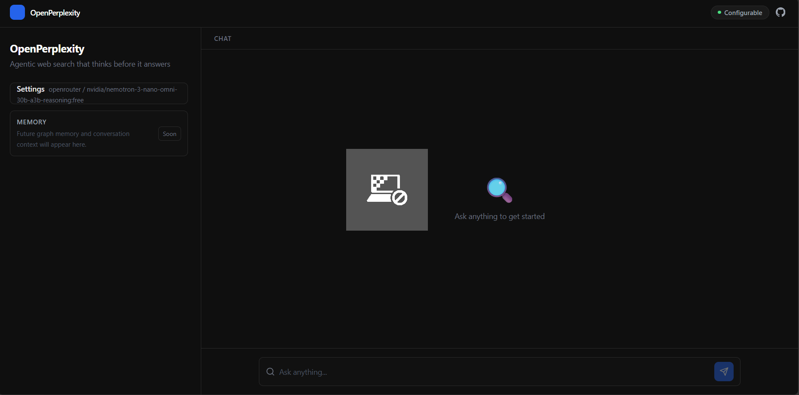
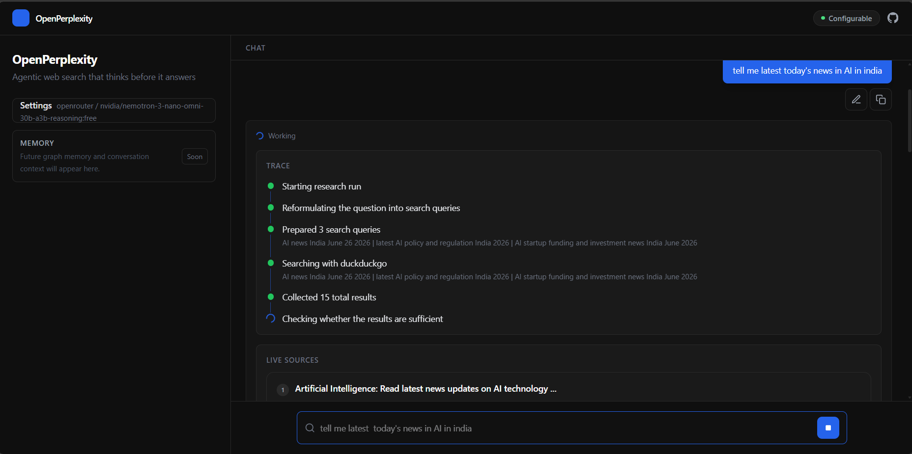
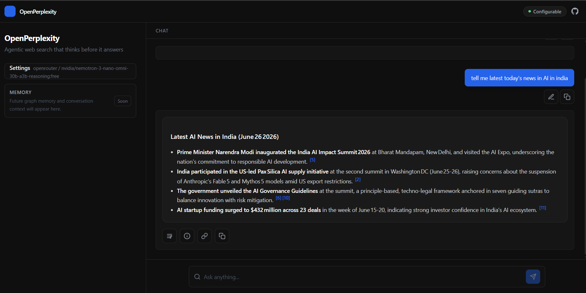

# OpenPerplexity

OpenPerplexity is an agentic web-search app. It takes a natural language question, turns it into better search queries, retrieves web results, evaluates whether it has enough evidence, and then synthesizes an answer with citations.

The project has a FastAPI + LangGraph backend and a React + Vite frontend.

## Features

- Agent-style research loop with query reformulation, web search, result evaluation, and answer synthesis
- Streaming responses with progress updates from the backend
- Citations returned with each answer
- Configurable LLM providers: OpenRouter, OpenAI, Gemini, and Ollama
- Configurable search providers: DuckDuckGo, Tavily, and SerpAPI
- React frontend for querying, model selection, and source display

## Tech Stack

- Backend: Python, FastAPI, LangGraph, LangChain
- Frontend: React, Vite, Tailwind CSS
- Search: DuckDuckGo, Tavily, SerpAPI
- LLMs: OpenRouter, OpenAI, Gemini, Ollama


## Screenshots

### Main Launch Screen



### App Working State



### Response With Citations



## Project Structure

```text
openperplexity/
|-- backend/
|   |-- main.py                 # FastAPI app and API routes
|   |-- graph.py                # LangGraph workflow
|   |-- state.py                # Agent state schema
|   |-- config.py               # Provider and environment configuration
|   |-- nodes/                  # Graph nodes
|   |-- requirements.txt
|   `-- .env.example
|-- frontend/
|   |-- src/
|   |   |-- api/                # API client
|   |   |-- components/         # UI components
|   |   |-- App.jsx
|   |   |-- config.js
|   |   `-- main.jsx
|   |-- package.json
|   `-- vite.config.js
|-- docs/                       # Static documentation site
|   `-- screenshots/            # README screenshots
|-- package.json                # Root helper scripts
`-- README.md
```

## Prerequisites

- Python 3.11+
- Node.js 18+
- npm
- An API key for at least one LLM provider, unless you use Ollama locally

## Setup

Run commands from the repository root.

### 1. Backend

```bash
python -m venv backend/.venv
```

Activate the virtual environment:

```bash
# Windows PowerShell
backend\.venv\Scripts\Activate.ps1

# macOS / Linux
source backend/.venv/bin/activate
```

Install Python dependencies:

```bash
pip install -r backend/requirements.txt
```

Create your backend environment file:

```bash
cp backend/.env.example backend/.env
```

Edit `backend/.env` and set your provider, model, and API keys.

Start the backend:

```bash
python -m uvicorn backend.main:app --reload --port 8001
```

Backend health check:

```text
http://localhost:8001/health
```

### 2. Frontend

Install frontend dependencies:

```bash
npm --prefix frontend install
```

Start the frontend:

```bash
npm --prefix frontend run dev
```

Open:

```text
http://localhost:5173
```

You can also use the root helper scripts:

```bash
npm run backend:dev
npm run frontend:dev
npm run frontend:build
```

## Configuration

Backend configuration lives in `backend/.env`.

| Variable | Default | Description |
| --- | --- | --- |
| `LLM_PROVIDER` | `openrouter` | `openrouter`, `openai`, `gemini`, or `ollama` |
| `LLM_MODEL` | empty | Model ID for the selected provider |
| `LLM_TEMPERATURE` | `0.2` | LLM generation temperature |
| `OPENROUTER_API_KEY` | empty | Required for OpenRouter |
| `OPENROUTER_BASE_URL` | `https://openrouter.ai/api/v1` | OpenRouter-compatible API base URL |
| `OPENROUTER_CA_BUNDLE` | empty | Optional custom CA bundle path |
| `OPENROUTER_VERIFY_SSL` | `true` | Set to `false` only for local proxy troubleshooting |
| `OPENAI_API_KEY` | empty | Required for OpenAI |
| `GOOGLE_API_KEY` | empty | Required for Gemini |
| `OLLAMA_BASE_URL` | `http://localhost:11434` | Ollama server URL |
| `SEARCH_PROVIDER` | `duckduckgo` | `duckduckgo`, `tavily`, or `serpapi` |
| `TAVILY_API_KEY` | empty | Required for Tavily |
| `SERPAPI_API_KEY` | empty | Required for SerpAPI |
| `SEARCH_RESULTS_PER_QUERY` | `5` | Search results fetched per generated query |
| `MAX_SEARCH_ITERATIONS` | `2` | Maximum follow-up search rounds |

Frontend display settings and API base URL are in `frontend/src/config.js`.

## API

### `GET /health`

Returns a simple backend health response.

### `POST /models`

Lists models for a provider.

```json
{
  "provider": "openrouter",
  "api_key": "optional-api-key"
}
```

### `POST /run`

Runs the research agent and returns the final answer.

```json
{
  "query": "What is agentic AI?",
  "llm_provider": "openrouter",
  "llm_model": "openai/gpt-4o-mini",
  "search_provider": "duckduckgo"
}
```

### `POST /run/stream`

Runs the same workflow as `POST /run`, but streams progress and answer chunks as Server-Sent Events.

## Development

Build the frontend:

```bash
npm --prefix frontend run build
```

Preview the production frontend build:

```bash
npm --prefix frontend run preview
```

Serve the static docs locally with any simple static server, for example:

```bash
python -m http.server 8080 -d docs
```

## License

This project is licensed under the MIT License. See the `LICENSE` file for details.
